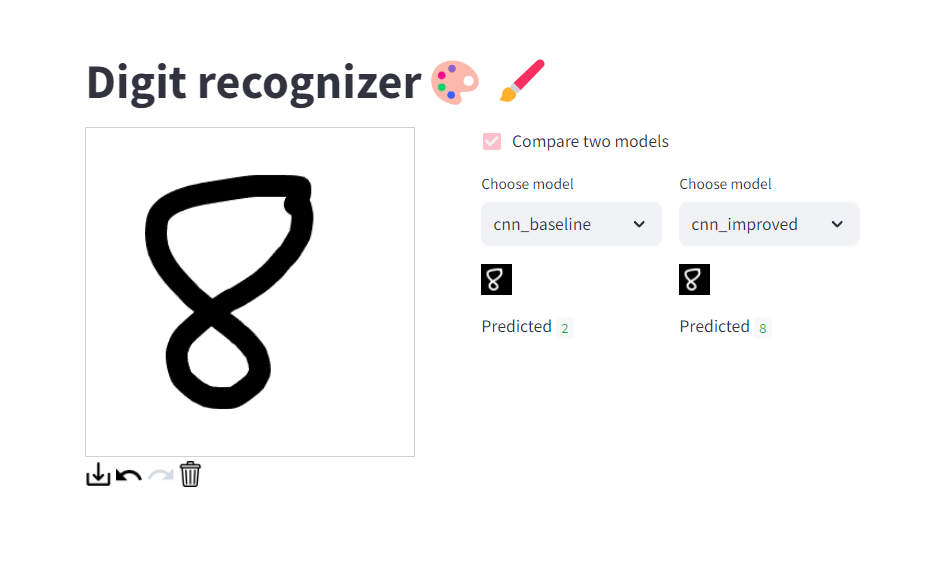

# Recognizing digits from user's drawing

Simple project to do exactly what the title says. Made with PyTorch and Streamlit. 
Try it out here: 

## Models:
- mlp_baseline: Basic MLP trained on MNIST dataset with 91.6% test accuracy. However, this model failed miserably when trying to predict my own handwriting. I ensured no data leakage during training, so the problem is probably that the MNIST dataset is too clean and different from real-life handwriting.

- cnn_baseline: Basic CNN trained on MNIST dataset with 96.5% test accuracy. Same problem as the MLP model.

- cnn_improved: Improved CNN architecture with batch normalization, dropout and data augmentation, 99% test accuracy. Performed much better on my own drawings, probably mainly thanks to the data augmentation.