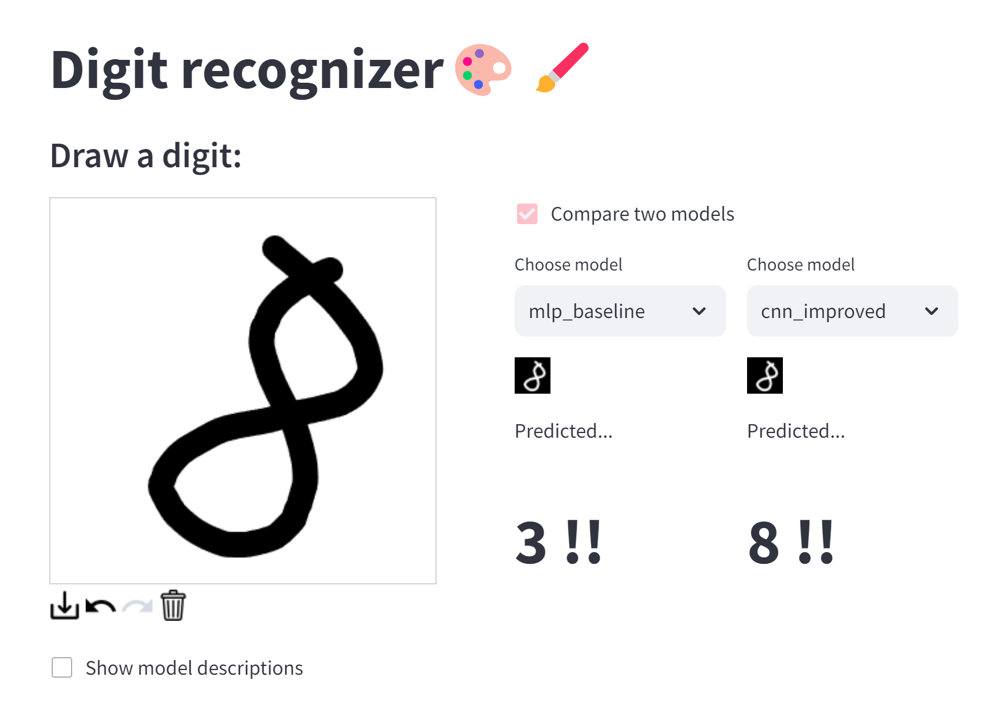

# Recognizing digits from user's drawing

Simple project to do exactly what the title says. Made with PyTorch and Streamlit. 
Try it out here: [https://digit-recognizer-bbb.streamlit.app/](https://digit-recognizer-bbb.streamlit.app/)

Fun fact: the dataset is small but I trained all models on my laptop CPU so this took a while... Couldn't train on Colab or Kaggle due to certain reasons.

## Models:
- `mlp_baseline`: Basic MLP trained on MNIST dataset with 91.6% test accuracy. However, this model failed miserably when trying to predict my own handwriting. I ensured no data leakage during training, so the problem is probably that the MNIST dataset is too clean and different from real-life handwriting.

- `cnn_baseline`: Basic CNN trained on MNIST dataset with 96.5% test accuracy. Same problem as the MLP model.

- `cnn_improved`: Improved CNN architecture with batch normalization, dropout and data augmentation, 99.1% test accuracy. Performed much better on my own drawings, probably mainly thanks to the data augmentation.

- `xgb_baseline`: Lightly tuned XGBoost model trained on flattened MNIST images, 97.6% test accuracy. As expected, this model overfits and performs poorly, which is expected since tree-based models are not the best for image data.

- `resnet18_finetune`: Fine-tuned ResNet18 model on MNIST dataset with data augmentation, giving 98.5% test accuracy. This model performed the best on my own drawings, being pre-trained on real-life images and having a more complex convolution-based architecture.